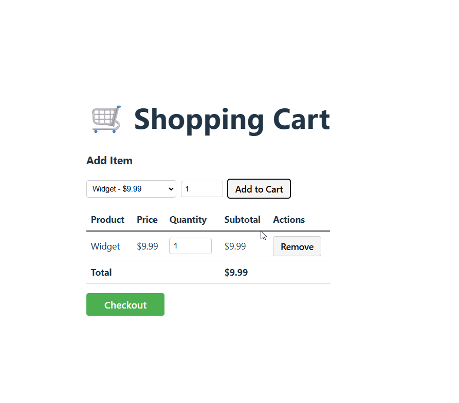

## Prerequisites

- [PowerShell](https://learn.microsoft.com/en-us/powershell/scripting/install/installing-powershell)
- [.NET 8 SDK](https://dotnet.microsoft.com/en-us/download/dotnet/8.0)
- [Node.js 18+](https://nodejs.org/) (npm is included with Node.js)

## Tooling

- An IDE of your choice (e.g. [Visual Studio](https://visualstudio.microsoft.com/), [Rider](https://www.jetbrains.com/rider/), or [VS Code](https://code.visualstudio.com/))

> You may use AI tools to support your thinking and problem-solving process during this exercise. However, these tools should assist you in understanding concepts, exploring approaches, or debugging — not in generating the final solution code for you. We want to evaluate your reasoning, design decisions, and coding ability.

Since the exercise uses a SQLite database, please install a tool to inspect SQLite databases for troubleshooting if needed. We recommend [SQLiteStudio](https://sqlitestudio.pl/).

## Project Structure

```
ecommerce/
├── src/
│   ├── ECommerce.UI/
│   ├── ECommerce.API/
│   ├── ECommerce.Consumer/
│   ├── ECommerce.QueueTool/
│   └── ECommerce.Shared/
└── tests/
    └── ECommerce.Tests/
```

## Running the Application

1. Download code from this [repository](https://github.com/leandromonaco/ecommerce)
2. Run `Start.ps1` (using cross-platform PowerShell)
3. Ensure the application is running successfully:
   - **API** → [http://localhost:53001/swagger](http://localhost:53001/swagger)
   - **UI** → [http://localhost:5174](http://localhost:5174)



## Assignments

1. **Assignment 1** — Implement an UX improvement that enhance usability and clarity.
2. **Assignment 2** — Implement the checkout process, including order creation and payment processing.

> Please send your work in a zip file by email in a week time since you receive this document. If you have any questions, feel free to reach out.

---

## Interview Process

During the interview, we will ask you to walk us through your implementation of the assignments. 

We are interested in understanding:

- Your understanding of the existing code
- Your refactoring and design decisions
- Your architectural reasoning and trade-offs
- Your ability to explain your decisions clearly
- How you debug, test, and iterate on your solution

We'll ask follow‑up questions about your implementation choices, so please be ready to walk us through your thinking.

